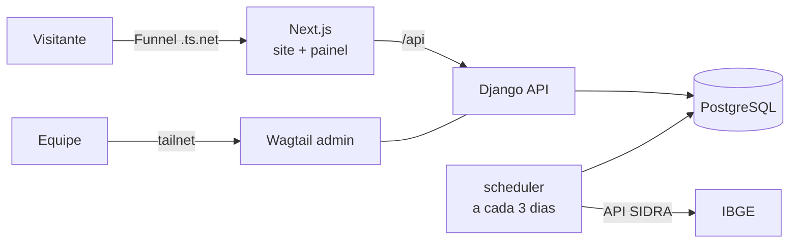
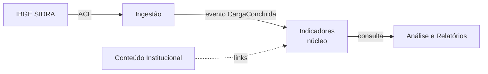
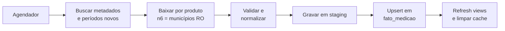

# Plano FAPERON: Novo Site e Central de Inteligência Agropecuária

Sep 24, 2026 · @Weslley Palomeque

A primeira entrega é um **protótipo evolutivo em 4 semanas**: Início, Central de Inteligência e Painel Agro Analítico RO, rodando em Docker na máquina da equipe e aberto por Tailscale Funnel, em paralelo ao site Wix atual. O mesmo código segue depois para a infraestrutura da FAPERON e completa a migração do site.

## Decisões fechadas

Cinco rodadas de entrevista (método grill-me: perguntas com recomendação) fecharam as decisões abaixo. Todas são da equipe de desenvolvimento; nenhuma depende de resposta da FAPERON.

| # | Pergunta | Decisão | Consequência |
| --- | --- | --- | --- |
| 1 | Relação com o Wix | Migrar o site inteiro para fora do Wix, depois do protótipo | O Wix segue no ar sem interrupção enquanto o protótipo é construído |
| 2 | Fonte de dados | IBGE SIDRA via API | Dados oficiais de PAM e PPM |
| 3 | Análise estratégica | Relatório por template, sem IA | Texto por regras, testável e auditável |
| 4 | Stack | Next.js + Django | Front em TypeScript, back em Python |
| 5 | Edição de conteúdo | CMS headless: Wagtail | Um só backend Python |
| 6 | Ordem de entrega | Início → Central → Painel primeiro | Sobre, Informativos Técnicos e Fale Conosco depois do protótipo |
| 7 | Escopo do painel | Agricultura + pecuária | PAM e PPM desde o protótipo |
| 8 | Natureza da entrega | Protótipo evolutivo, operação enxuta | Arquitetura e testes de produção; sem Celery/Redis por enquanto |
| 9 | Ambiente | Docker Compose local agora; infra da FAPERON no futuro | Tudo em containers para mudar de máquina sem retrabalho |
| 10 | Acesso externo | Tailscale Funnel aberto, sem senha | Link público .ts.net; admin do Wagtail fica fora do Funnel |
| 11 | Dados da demo | Ingestão real a cada 3 dias, gravada no banco, + snapshot versionado | Demo não depende da API do IBGE no momento da apresentação |
| 12 | Catálogo de produtos | O que o IBGE publicar para RO | Sem lista mantida à mão; o número 89 deixa de ser requisito |
| 13 | Ranking com período | Sempre o ano final do período | O período vale para a série histórica; sem regra de agregação |
| 14 | Prazo | Protótipo em 4 semanas | Com 3 devs, comparação e análise entram completas |
| 15 | Máquina da demo | Notebook de um dev | Link só fica no ar com o notebook ligado; apresentações em horário combinado |
| 16 | Notícias do Início | Importar do site Wix | Script de importação vira a base da migração na Fase 2 |
| 17 | Commodities | Link para o site da CNA, como hoje | Botão no Início que abre o site da CNA; sem integração de dados |
| 18 | Identidade visual | Marca atual, layout novo | Logo, cores e fontes extraídos do site atual viram os tokens do design system |
| 19 | Equipe | 3 devs: Vinicius, Weslley e Ranieri | Três trilhas em paralelo; escopo completo cabe nas 4 semanas |

O termo "DDT" do pedido foi lido como **TDD** (Test-Driven Development); se era outra prática, ajustar a seção de Testes.

## Escopo e fases

São três fases. O protótipo entrega a jornada Início → Central de Inteligência → Painel em 4 semanas; a produção leva o mesmo código para a infra da FAPERON e completa o site.

| Fase | Entrega | Inclui | Fora do escopo |
| --- | --- | --- | --- |
| 1. Protótipo (4 semanas) | Início + Central + Painel, local em Docker, aberto via Tailscale Funnel | Fundação (monorepo, CI, ADRs); **Início** (destaque da Central, notícias recentes, commodities, Nosso Agro); **Central de Inteligência** (landing); **Painel** (ingestão PAM + PPM a cada 3 dias, filtros, ranking, série histórica, comparação, análise por template, PDF) | Sobre, Informativos Técnicos, Fale Conosco; Celery, Redis; migração do Wix |
| 2. Produção | Plataforma na infra da FAPERON e o site completo fora do Wix | Deploy na infra da FAPERON, Celery/Redis se a carga pedir; Sobre, Informativos Técnicos, Transparência, Fale Conosco; migração de notícias e PDFs; redirects 301; desligamento do Wix; análise e comparação completas | Redesenho do sistemafaperon.org.br |
| 3. Evolução | Melhorias pós-lançamento | Mapa coroplético por município, API pública de dados, novas fontes (CONAB, IDARON) | — |


A jornada acima é o fluxo de navegação do protótipo: o Início leva à Central, que apresenta e abre o Painel. O site Wix segue no ar durante todo o protótipo.

A segunda missão da reunião (a entrega de serviço) não está neste plano e ganha um plano próprio.

## Stack e arquitetura

Um monorepo com dois serviços: Next.js renderiza tudo o que o público vê, e Django concentra CMS, dados do IBGE, regras de análise e PDF. A coluna Protótipo mostra o que fica mais simples agora sem mudar a arquitetura.

| Camada | Tecnologia | Papel | Protótipo |
| --- | --- | --- | --- |
| Front-end | Next.js (App Router) + TypeScript | SSG/ISR nas páginas, componentes cliente no painel; faz proxy de `/api` para o Django | Igual |
| UI | Tailwind CSS + shadcn/ui | Design system com a identidade da FAPERON | Igual |
| Gráficos | Apache ECharts | Colunas, comparação, SVG para o PDF | Igual |
| Estado/consulta | TanStack Query + filtros na URL | Busca compartilhável por link | Igual |
| Back-end | Django 5 + Django REST Framework | API do painel, OpenAPI (drf-spectacular) | Igual |
| CMS | Wagtail (API headless) | Início, Central, notícias | Admin só na tailnet |
| Banco | PostgreSQL 16 | Conteúdo e fatos; views materializadas | Igual, volume Docker |
| Agendamento | Celery Beat + workers | Ingestão e PDF assíncrono | Container `scheduler` rodando `manage.py ingest_sidra` a cada 3 dias |
| Cache | Redis | Respostas do painel | Sem cache; views materializadas bastam |
| PDF | WeasyPrint | Relatório por template | Síncrono na requisição |
| Infra | Docker Compose, proxy reverso, storage S3-compatível | Infra da FAPERON | Compose na máquina da equipe + Tailscale Funnel na porta 443; mídia em volume local |
| Qualidade | pytest, Vitest, Playwright, Ruff, ESLint, mypy | Testes e lint no CI | Igual |



O Funnel expõe só o Next.js; o Django fica acessível apenas pelo proxy `/api`, e o admin do Wagtail só por quem está na tailnet (`tailscale serve`).

## Domínio (DDD)

O sistema se divide em quatro bounded contexts, cada um como um app Django com fronteira explícita. Só o contexto Indicadores fala com o IBGE; os outros leem o modelo de leitura dele.

| Contexto | Tipo | Responsabilidade | Agregados principais |
| --- | --- | --- | --- |
| Conteúdo Institucional | Genérico (Wagtail) | Páginas, notícias, boletins, diretoria, transparência | Page, Noticia, Boletim, MembroDiretoria |
| Ingestão | Suporte | Buscar, validar e versionar dados do SIDRA | Carga (Job de ingestão), FonteSidra |
| Indicadores Agropecuários | **Núcleo** | Catálogo de produtos e indicadores, fatos por município/ano, ranking, série, comparação | Produto, Indicador, Municipio, Medicao |
| Análise e Relatórios | Suporte | Regras da análise estratégica e PDF | Relatorio, RegraDeAnalise |



A Ingestão é uma Anti-Corruption Layer: traduz códigos e respostas do SIDRA para a linguagem do domínio, e nenhum outro módulo conhece o formato do IBGE.

**Linguagem ubíqua** (vale para código, telas e conversas com a FAPERON):

| Termo | Significado |
| --- | --- |
| Produto | Cultura agrícola (ex.: soja, café canéfora) ou item pecuário (rebanho bovino, leite) |
| Segmento | Agricultura ou Pecuária |
| Indicador | Medida publicada pelo IBGE: área plantada, área colhida, quantidade produzida, rendimento médio, valor da produção; na pecuária, efetivo e produção de origem animal |
| Medição | Valor de um Indicador para um Produto, Município e Ano, com unidade |
| Período | Ano inicial e ano final da consulta |
| Ranking | Municípios de Rondônia ordenados pelo valor do Indicador no Período |
| Série histórica | Medições ano a ano de um recorte |
| Recorte | Combinação Produto + Indicador + Período + (Município opcional) |
| Carga | Execução de ingestão de uma tabela SIDRA, com status e versão |

Invariantes do núcleo: uma Medição é única por (Produto, Indicador, Município, Ano, Carga); valores sigilosos ou ausentes do IBGE ("X", "-", "...") viram estado explícito, nunca zero; rendimento médio não é somado entre municípios nem anos.

## Dados IBGE e ingestão

O painel sai de três tabelas do SIDRA, todas com nível município e série anual; os 52 municípios de Rondônia são o recorte territorial.

| Tabela SIDRA | Pesquisa | Conteúdo | Período |
| --- | --- | --- | --- |
| [5457](https://sidra.ibge.gov.br/Tabela/5457) | PAM | Lavouras temporárias e permanentes: área plantada, área colhida, quantidade produzida, rendimento médio, valor da produção | 1974–2024 |
| [3939](https://sidra.ibge.gov.br/Tabela/3939) | PPM | Efetivo dos rebanhos por tipo (bovino, suíno, galináceos etc.) | anual |
| [74](https://sidra.ibge.gov.br/tabela/74) | PPM | Produção de origem animal por produto (leite, ovos, mel etc.), quantidade e valor | anual |

O catálogo exibido é o que o IBGE publicar para Rondônia (a tabela 5457 tem cerca de 70 produtos); não há lista mantida à mão. A API do IBGE não pôde ser consultada deste ambiente, então o spike da semana 1 confirma códigos e limites.

**Modelo de leitura (star schema no Postgres):**

| Tabela | Tipo | Colunas principais |
| --- | --- | --- |
| dim\_produto | Dimensão | id, codigo\_ibge, nome, segmento (agricultura/pecuária), tabela\_origem |
| dim\_indicador | Dimensão | id, codigo\_ibge, nome, unidade, agregacao (soma / média ponderada / não agregável) |
| dim\_municipio | Dimensão | codigo\_ibge (7 dígitos), nome, microrregião, geometria (fase 3) |
| fato\_medicao | Fato | produto, indicador, municipio, ano, valor (numeric), status\_valor (ok/sigiloso/inexistente), carga\_id |
| carga | Auditoria | id, tabela, iniciada\_em, concluida\_em, linhas, hash, status |
| mv\_ranking | View materializada | ranking por produto × indicador × ano, atualizada após cada carga |

**Pipeline de ingestão** (a cada 3 dias pelo container `scheduler`; na produção, Celery Beat). O IBGE publica uma vez por ano, então a maioria das execuções só confirma que nada mudou; o hash da resposta evita regravar dados iguais.



Cada etapa é idempotente: rodar a mesma Carga duas vezes produz o mesmo estado. Falha em qualquer etapa mantém os dados anteriores no banco e registra o erro na tabela `carga`. Após a primeira carga completa, `make snapshot` gera um dump versionado no repositório (`data/seed/`), que qualquer máquina carrega com `make seed` sem acessar o IBGE. As chamadas usam a API de agregados v3 (`/api/v3/agregados/{tabela}/periodos/{p}/variaveis/{v}?localidades=N6[N3[11]]&classificacao=...`), consultando um produto por vez para respeitar o limite de valores por consulta.

## Specs

Cada funcionalidade vira uma Spec em `docs/specs/` com critérios de aceite em Gherkin; o mesmo texto vira o primeiro teste que falha (TDD). As Specs abaixo são do MVP da Central de Inteligência.

| ID | Funcionalidade | Critério de aceite principal |
| --- | --- | --- |
| SPEC-01 | Landing page da Central | Página editada no Wagtail com chamada para o painel; Lighthouse ≥ 90 em Performance, SEO e Acessibilidade |
| SPEC-02 | Filtros | Segmento → Produto (busca por nome) → Indicador → Ano inicial/final; opções vêm da API; filtros ficam na URL e o link reproduz a consulta |
| SPEC-03 | Ranking de municípios | Lista os 52 municípios ordenados do maior para o menor valor no ano final do período; sigiloso aparece como "X" no fim; mostra posição, valor, unidade e % do total estadual |
| SPEC-04 | Série histórica | Gráfico de colunas por ano no período; total de RO ou município escolhido; tooltip com valor e unidade |
| SPEC-05 | Comparação | Até 5 municípios (ou produtos, mesmo indicador e unidade) em colunas agrupadas; bloqueia comparar unidades diferentes |
| SPEC-06 | Análise estratégica | Texto gerado por regras: variação no período, CAGR, maior e menor ano, top 5 municípios, concentração (participação do top 5) |
| SPEC-07 | Relatório PDF | Botão gera PDF com filtros, gráfico, ranking, análise, fonte IBGE e data da carga; < 10 s para o caso típico; mesmo recorte = mesmo PDF (cache) |
| SPEC-08 | Nota metodológica | Toda tela exibe fonte, tabela SIDRA e data de atualização |

Exemplo de critério em Gherkin (SPEC-03):

```gherkin
Funcionalidade: Ranking de municípios
  Cenário: Ordenar pelo indicador escolhido
    Dado que existem medições de "Quantidade produzida" de "Soja" em 2024
    Quando eu consulto o ranking de Soja, Quantidade produzida, 2024–2024
    Então os municípios aparecem em ordem decrescente de valor
    E municípios com valor sigiloso aparecem ao final marcados com "X"
```

Regra de período: o ranking usa sempre o **ano final** do período; o ano inicial e o final definem o intervalo da série histórica e da comparação. Não há soma nem média entre anos no ranking.

**Contrato da API** (OpenAPI gerado pelo Django e tipos TS gerados a partir dele):

| Endpoint | Retorno |
| --- | --- |
| `GET /api/v1/produtos?segmento=` | Catálogo de produtos |
| `GET /api/v1/indicadores?produto=` | Indicadores disponíveis e unidades |
| `GET /api/v1/ranking?produto&indicador&inicio&fim` | Ranking de municípios |
| `GET /api/v1/serie?produto&indicador&inicio&fim&municipio?` | Série anual |
| `GET /api/v1/comparacao?...&municipios=` | Séries lado a lado |
| `GET /api/v1/analise?...` | Texto da análise e métricas |
| `GET /api/v1/relatorio.pdf (protótipo); POST /api/v1/relatorios + GET /api/v1/relatorios/{id} (produção)` | PDF síncrono no protótipo; assíncrono na produção |

## ADRs

As decisões ficam em `docs/adr/NNNN-titulo.md` no formato MADR (Contexto, Opções, Decisão, Consequências). Nenhuma decisão aceita é editada: uma nova ADR a substitui (status "Substituída por").

| ADR | Decisão | Alternativas descartadas | Motivo |
| --- | --- | --- | --- |
| 0001 | Registrar decisões em ADRs (MADR) no repositório | Wiki, Confluence | Decisão versionada junto do código |
| 0002 | Sair do Wix para plataforma própria | Manter Wix + iframe, Wix Velo | Gráficos, PDF, SEO e dados pesados não cabem no Wix |
| 0003 | Monorepo com `apps/web` (Next.js) e `apps/api` (Django) | Dois repositórios | Contrato da API e CI num lugar só |
| 0004 | Wagtail como CMS headless | Strapi, Payload, WordPress | Um único backend Python |
| 0005 | PostgreSQL com star schema e views materializadas | Data warehouse, NoSQL | Volume pequeno cabe no Postgres |
| 0006 | Ingestão via API SIDRA a cada 3 dias, com staging, hash e cargas versionadas | Download manual de CSV, carga única | Automação, auditoria e reprocessamento |
| 0007 | Análise estratégica por regras determinísticas | LLM | Reprodutível e auditável |
| 0008 | PDF no servidor com WeasyPrint | Puppeteer, PDF no navegador | Mesmo layout sempre; stack Python |
| 0009 | ECharts para gráficos | Recharts, Chart.js | Colunas agrupadas, SVG, mapas na fase 3 |
| 0010 | Tudo em Docker Compose; protótipo local, produção na infra da FAPERON | PaaS | Mesma definição de ambiente nos dois lugares |
| 0011 | Tipos TS gerados do OpenAPI do Django | Tipos manuais | Front quebra no build se a API mudar |
| 0012 | Redirects 301 de todas as URLs do Wix (fase de produção) | Deixar 404 | Preserva SEO e links |
| 0013 | Protótipo evolutivo com operação enxuta: sem Celery/Redis, agendamento por container `scheduler`, PDF síncrono | Stack completa já; mockup descartável | Demonstra rápido sem jogar código fora |
| 0014 | Acesso externo por Tailscale Funnel aberto; só o Next.js exposto; admin via tailnet | Funnel com senha; convite na tailnet | Quem recebe o link abre sem instalar nada |
| 0015 | Ranking pelo ano final do período | Soma/média do período | Simples de explicar; sem regra de agregação por indicador |
| 0016 | Catálogo de produtos = o publicado pelo IBGE para RO | Lista curada; juntar tabelas de safra | Sem manutenção manual |
| 0017 | Snapshot do banco versionado em `data/seed/` | Depender da API na demo | Demo reproduzível em qualquer máquina |
| 0018 | Notícias importadas do Wix por script pontual (comando manage.py import\_wix\_news) | Cadastro manual; conteúdo fictício | Conteúdo real na demo e base da migração |

## Testes (TDD)

O ciclo é vermelho → verde → refatorar, começando pelo critério de aceite da Spec. O foco do TDD é o núcleo (Indicadores e Análise), onde um erro de cálculo vira informação errada publicada pela FAPERON.

| Camada | O que se testa | Ferramenta | Meta |
| --- | --- | --- | --- |
| Domínio | Ranking, agregação por período, média ponderada do rendimento, regras da análise, tratamento de sigiloso | pytest + hypothesis | Cobertura ≥ 90% no núcleo |
| Ingestão (ACL) | Parser das respostas do SIDRA, idempotência da carga | pytest + respostas gravadas (fixtures JSON reais) | Todo formato de resposta conhecido coberto |
| API | Contrato, filtros, erros, paginação | pytest-django + schemathesis contra o OpenAPI | Todos os endpoints |
| Banco | Migrações e views materializadas | pytest com Postgres real (Testcontainers) | Migração roda do zero no CI |
| Front (unidade) | Formatação de números e unidades, estado dos filtros | Vitest + Testing Library | Componentes do painel |
| E2E | Fluxo completo: filtrar → ranking → série → PDF | Playwright | Cenários Gherkin das Specs |
| Acessibilidade | WCAG 2.1 AA | axe-core no Playwright | Zero violações sérias |
| PDF | Layout do relatório | Snapshot visual do PDF renderizado | Sem regressão visual |

Um conjunto de "números de ouro" (valores conferidos manualmente no SIDRA para 3 produtos e 5 municípios) roda a cada carga e bloqueia a publicação se divergir.

## Boas práticas

Estas regras valem desde a Sprint 0 e são checadas no CI, não só em revisão.

| Área | Prática |
| --- | --- |
| Repositório | Trunk-based com PRs curtos, Conventional Commits, CODEOWNERS, template de PR com link para Spec/ADR |
| Estrutura | `apps/web`, `apps/api`, `docs/adr`, `docs/specs`, `infra/`; um app Django por bounded context |
| CI (GitHub Actions) | Lint (Ruff, ESLint), tipos (mypy, tsc), testes, build das imagens, verificação de migrações, Lighthouse CI |
| CD | Ambientes dev → homologação → produção; homologação aprovada pela FAPERON antes de cada release |
| Definition of Done | Spec atendida, testes verdes, ADR quando houver decisão, documentação de API atualizada, revisado por outra pessoa |
| SEO e migração | Inventário de todas as URLs do Wix, mapa de redirects 301, sitemap.xml, metadados Open Graph, Search Console antes e depois |
| Acessibilidade | WCAG 2.1 AA; gráficos com tabela alternativa e descrição textual; paleta com contraste validado |
| Performance | ISR nas páginas do CMS, cache Redis no painel, imagens AVIF/WebP via next/image; LCP < 2,5 s em 4G |
| Segurança | Segredos fora do repositório, Dependabot, cabeçalhos de segurança (CSP, HSTS), rate limit na API e no PDF, admin Wagtail com 2FA |
| LGPD | Formulário Fale Conosco com base legal e aviso de privacidade, retenção definida, banner de cookies só se houver analytics com cookies |
| Observabilidade | Logs estruturados, Sentry (front e back), métricas de carga do IBGE, alerta de falha de ingestão, uptime monitor |
| Backup | Dump diário do Postgres e da mídia, restauração testada por trimestre |
| Transparência | Portal da Transparência do site atual migrado sem perda de documentos nem de URLs |

## Roadmap

O protótipo leva 4 semanas, em ciclos de uma semana com demo interna toda sexta. São três trilhas em paralelo; a divisão de nomes abaixo é uma sugestão, e a equipe pode trocar.

| Semana | Trilha A — Site e CMS (Vinicius) | Trilha B — Dados e API (Ranieri) | Trilha C — Liderança, painel e infra (Weslley) | Marco |
| --- | --- | --- | --- | --- |
| 1 | Wagtail + layout base (cabeçalho, menu, rodapé); design system com logo, cores e fontes do site atual | Spike SIDRA, star schema, comando `ingest_sidra` para PAM | Monorepo, Docker Compose, CI, ADRs 0001–0018 no repo, Tailscale Funnel/serve | `docker compose up` sobe tudo |
| 2 | **Início** (destaque da Central, notícias, link de commodities para a CNA, Nosso Agro); `import_wix_news` | PPM, container `scheduler` (3 dias), snapshot `data/seed/`, números de ouro | API de produtos, indicadores e ranking; tipos TS gerados do OpenAPI | Início navegável com dados reais |
| 3 | **Central de Inteligência** (landing no Wagtail); acessibilidade e responsivo | API de série, comparação e análise por regras | **Painel**: filtros na URL, ranking, série histórica, comparação | Painel funcional |
| 4 | Template visual do PDF; ajustes finais do site | PDF com WeasyPrint, rate limit, testes de contrato | E2E Playwright do fluxo principal, checklist de demo no notebook | **Protótipo pronto para apresentação** |

Pontos de integração entre trilhas: o contrato OpenAPI fica pronto no meio da semana 2 (B → C), e o design system no fim da semana 1 (A → C). Até lá, C trabalha com mocks gerados do contrato.

## Primeiros passos

Checklist do primeiro dia, para os três começarem sem bloqueio:

- [ ] Criar o repositório com `apps/web`, `apps/api`, `docs/adr`, `docs/specs`, `data/seed`, `infra/`
- [ ] Copiar as ADRs 0001–0018 e as SPEC-01 a SPEC-08 deste plano para `docs/`
- [ ] Subir o `docker-compose.yml` mínimo: Postgres, Django (Wagtail) e Next.js
- [ ] Configurar o CI: Ruff, mypy, pytest, ESLint, tsc, Vitest
- [ ] Criar o quadro de tarefas com as três trilhas e as entregas da semana 1
- [ ] Escrever o primeiro teste que falha: parser de uma resposta real da tabela 5457 (TDD)
- [ ] Instalar o Tailscale no notebook da demo e reservar o nome da máquina para o Funnel
- [ ] Marcar a demo interna da sexta da semana 1

## Riscos e perguntas abertas

| Risco | Impacto | Mitigação | Situação |
| --- | --- | --- | --- |
| API do SIDRA instável ou com limite por consulta | Carga falha | Retry com backoff, um produto por consulta, dados anteriores preservados, snapshot | Resolvido (ADR 0006, 0017) |
| Demo depender da internet do IBGE | Painel vazio na apresentação | Snapshot versionado carregado com `make seed` | Resolvido (ADR 0017) |
| Divergência 89 × \~70 culturas | Expectativa não atendida | Catálogo = o que o IBGE publica | Resolvido (ADR 0016) |
| Regra de agregação do ranking errada | Números incorretos | Ranking pelo ano final, sem agregação | Resolvido (ADR 0015) |
| Funnel aberto expõe o admin ou o banco | Invasão do protótipo | Só o Next.js no Funnel; admin por `tailscale serve`; Postgres sem porta publicada | Resolvido (ADR 0014) |
| Funnel aberto permite abuso do PDF | Notebook sobrecarregado | Rate limit por IP no endpoint de PDF e cache do arquivo por recorte | Mitigação no plano |
| Notebook dormir, reiniciar ou perder rede | Link fora do ar | Desativar suspensão durante demos, `restart: unless-stopped`, Tailscale iniciando com o sistema; checklist antes de cada apresentação | Aceito (decisão 15) |
| Ingestão a cada 3 dias perdida com notebook desligado | Dados não atualizados | O `scheduler` roda ao subir se a última carga tiver mais de 3 dias; IBGE só muda uma vez por ano | Mitigação no plano |
| Importação de notícias quebrar com mudanças no HTML do Wix | Início sem notícias novas | Importação é pontual (roda manualmente), não sincronização | Mitigação no plano |
| Migração do Wix e perda de SEO | Menos visitas | Inventário de URLs e redirects 301 na produção | Adiado para a Fase 2 |
| Prazo de 4 semanas com equipe pequena | Protótipo incompleto | Três trilhas em paralelo com contrato de API e design system como pontos de integração | Mitigação no plano |

Não há decisão nem ponto técnico em aberto. O bloco de commodities do Início continua sendo um link para o site da CNA, como no site atual.

## Fontes

- [Site atual da FAPERON (Wix)](https://www.faperon.com.br/)
- [Sistema FAPERON – SENAR (WordPress)](https://sistemafaperon.org.br/)
- [SIDRA Tabela 5457 – PAM](https://sidra.ibge.gov.br/Tabela/5457)
- [Explorador de metadados da tabela 5457](https://fish.quantilica.com/tabelas/5457/area-plantada-destinada-colheita-area-colhida-quantidade-produzida-rendimento-medio-valor-producao-l)
- [SIDRA Tabela 3939 – Efetivo dos rebanhos](https://sidra.ibge.gov.br/Tabela/3939)
- [SIDRA Tabela 74 – Produção de origem animal](https://sidra.ibge.gov.br/tabela/74)
